#myMDB (Movie Tracker) Website

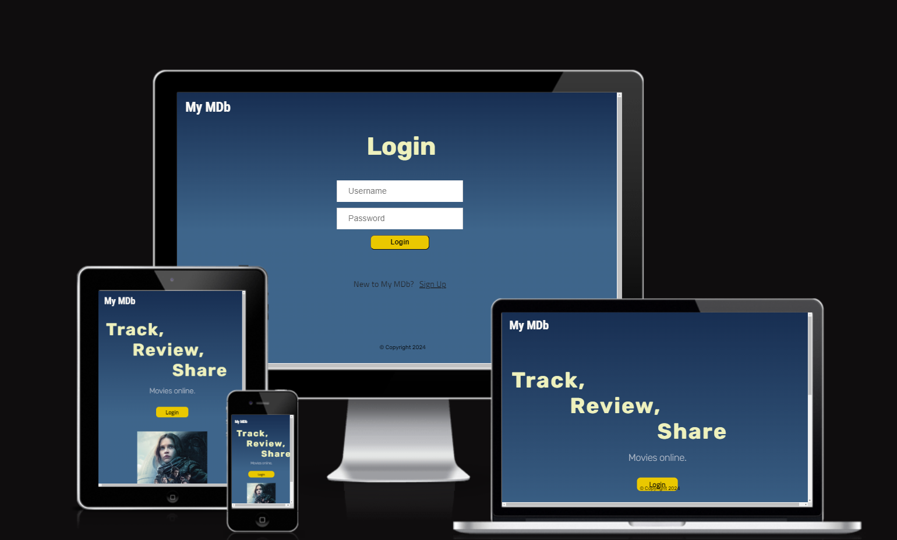

# Project Overview

Welcome,

This is myMDb ("my MDb") website, a full-stack site for movie enthusiasts to search, track and review movies they have watched. They will also be able to view what movies other members have been watching. This is Rachel Luke's submission for Code Institute's Backend Development Milestone.

The following are high-level details of this project:

-  This is a relational database backed Flask project for a web application that allows users to store and manipulate data records on movies they have watched.
- The main technologies used are HTML, CSS, JavaScript, Python+Flask and PostgreSQL.
- The project demonstrates backend development web design.
- User functionality is intuitive to users (to create, locate, display, edit and delete records).
- The site has a main navigation in the header and a structured layout.
- Git & GitHub are used for version control.
- Any external code sources used in the project are clearly identified in the code itself and in this README.md file
- The final version has been deployed via GitHub Pages.
- There are no passwords or secret keys in the project repository. 

The last update to this file was: **October 22nd, 2024**

\
    &nbsp;
# Table of Contents

- [My MDb](#my-mdb)
- [Project Overview](#project-overview)
- [Table of Contents](#table-of-contents)
- [UX](#ux)
  - [User Goals](#user-goals)
  - [User Stories](#user-stories)
  - [Site Owners Goals](#site-owners-goals)
    - [Requirements](#requirements)
    - [Expectations](#expectations)
- [UI / Design Choices](#ui-design-choices)
  - [Moodboard](#moodboard)
  - [Fonts](#fonts)
  - [Icons](#icons)
  - [Colours](#colours)
  - [Media Queries](#media-queries)
  - [Wireframes](#wireframes)
  - [Mockups](#mockups)
- [Features](#features)
  - [Existing Features](#existing-features)
   - [Future Features - to be implemented](#future-features)
- [Technologies used](#technologies-used)
  - [Languages](#languages)
  - [IDE](#ide)
  - [Libraries & Framework](#libraries-framework)
  - [Tools](#tools)
- [Validating](#validating)
- [Testing](#testing)
  - [Testing User Stories](#testing-user-stories)
  - [Debugging](#debugging)
  - [Unfixed bugs](#unfixed-bugs)
- [Deployment](#deployment)
  - [Heroku](#heroku)
  - [How to Run this Project Localy](#how-to-run-this-project-locally)
- [Credits](#credits)

\
    &nbsp;
# UX

## User Goals

1. Upload and track movies watched.
2. Edit and delete movie listings/ reviews.
3. Easily navigate around website.
4. Log in/sign up account.
5. View other users' listed movies.

## User Stories

1. As a user, I want to be able to login/ register my account.
2. As a user, I want to be able to create, read, update and delete my movie entries.
3. As a user, I want to be able to view other users' entries.
4. As a user, I want to be able to navigate around the website easily.
5. As a user, I want to be able to logout of my account.

## Site Owners Goals

1. Upload their own watched movies and view other users' tracked movies.
2. Increase the number of online foot traffic.
3. Increase rankings on search engines.

### Requirements

1. Easy to navigate on various screen sizes.
2. Clear information on what the website offers (a movie tracker).
3. Functioning CRUD website to track own movies and view other users' watched movies.
4. Working backend and database management.
5. Visually inviting so users engage longer on the website.
  
### Expectations

1. I expect to be able to login or sign up for an account if I do not have an existing one.
2. I expect to be able to CRUD (create, read, update and delete) my movie trackings.
3. I expect to be able to view other users' movie trackings.
4. I expect screen size not to affect the quality of the website.
5. I expect all information to be correct and accurate.

\
&nbsp;
[Back to Top](#table-of-contents)
\
&nbsp;

# UI / Design Choices

## Moodboard

One of the first milestones of this project was to create a moodboard to help envision the overall house style of the website and ensure that all of the sections and elements are cohesive. The software I used to create the moodboard for this website is [Mila Note](https://milanote.com/ "Mila Note").
Below, is the moodboard:


## Fonts

- In order to 'jazz things up', and move away from the basic fonts available, I have used [Google Fonts](https://fonts.google.com/ "Google Fonts") to find a text that best suits the feel of the website. 
- For the launch page and also for all of the page headers, I decided to use [Rubik](https://fonts.google.com/?query=rubik "Rubik font"). This font fits the futuristic theme and is also clear and easy to read. 
- For the buttons and main text, I have chosen [Titillium Web](https://fonts.google.com/specimen/Titillium+Web "Titillium Web") as I feel it suits the sci-fi feel to the website and it also is not as bold as the header font.
- Last but not least, for the My MDb logo, I picked a similar font used for IMDb's logo which is [Roboto Condensed](https://fonts.google.com/specimen/Roboto+Condensed "Roboto Condensed"). This font compliments the other fonts and also suits the cinematic theme.

Additional Notes:

- I have intentionally imported the fonts in the css file and not the html files as it saved some space in the html file and as this is a static website, the slightly longer loading time is not critical.
  
- Backup fonts (sans-serif) have been put in place as a safety net, in case the custom fonts used are not available.

- There is a 'double reset' in the css file. It simplifies calculate rem unit as I no longer need to think in scale factor of 1.6 but 10 instead.

## Icons

During testing, the console indicated that an icon from Favicon was required as the 'logo' symbol for the browser tab. As a fitting icon, I downloaded and incoporated the film icon from [Favicon](https://favicon.io/ "Favicon").

## Colours

The colour scheme of the website is inspired by the moodboard (previously depicted). I have used [Coolers](https://coolors.co/ "coolers") to retrieve the desired colour codes and generate the colour palette.

Below, is the color palette:


## Media Queries

As a starting point, I have designed this website with a mobile first mindset using the iPhone 5/SE (320px) as the smallest screen size for styling to look good on. Then I created 3 additional media queries for largers devices listed below.

| Screen Size |  Breakpoint |
| ----------- | ----------- | 
| mobile      |  <320px     |
| tablet      |  => 768px   |
| laptop      |  => 1920px  |
| desktop     |  => 2560px  |

\
&nbsp;
[Back to Top](#table-of-contents)
\
&nbsp;

## Wireframes

I have used [Balsamiq](https://balsamiq.com/wireframes/ "Balsamiq") to develop my wireframes for my website. I initially created the mobile version and then the wireframes and then scaled it up for desktop. The website has 3 pages that are all scrollable and displays/hides sections with logic in lieu of having even more HTML pages to decrease inconvenient reloading of entire website.

The wireframes are below:

[Landing Page - Mobile & Desktop Wireframes](docs/wireframes/wireframe-landing-page-mobile-desktop.png "home mobile and desktop wireframes")

[Login Page - Mobile & Desktop Wireframes](docs/wireframes/wireframe-login-page-mobile-desktop.png "login mobile and desktop wireframes")

[Main Page - Mobile & Desktop Wireframes](docs/wireframes/wireframe-main-page-mobile-desktop.png "main mobile and desktop wireframes")

[Community Page - Mobile & Desktop Wireframes](docs/wireframes/wireframe-community-page-mobile-desktop.png "community mobile and desktop wireframes")

\
&nbsp;
[Back to Top](#table-of-contents)
\
&nbsp;

## Mockups
Based on the wireframes, I created mockups using [Figma](https://www.figma.com/ "Figma") to help me plan the interface design. Mockups for both mobile and desktop have been created as part of the website design phase, and can be viewed via this link [Mockups](https://www.figma.com/design/9iYeCSMx1ZhPTEsWesTW6V/Project-3?node-id=0-1&t=h3CqbXc5uzz9nmsm-1 "Mockups").

\
&nbsp;
[Back to Top](#table-of-contents)
\
&nbsp;

# Features 

## Existing Features

### Landing Page

- Intuitive User Experience
  - When the website launches for the first time, the user is directed to a page, which 'sets the scene'. The website logo, some description to indicate what the website can be used for and an image all help the user understand on-the-spot what this website's purpose is. Moreover, there is an eye-catching, call-to-action 'login' button.
  \
    &nbsp;

    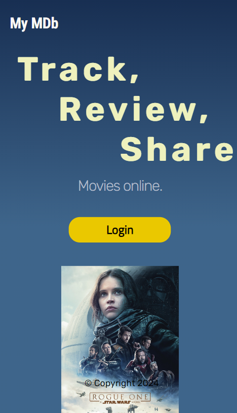

    \
    &nbsp;
  
  - Also, the screen layout adjusts depending on the user's screen size to ensure the readability/ aesthetics are maintained. The photo above is for mobile (default), whereas the photo below is for the website's laptop media query design.
  \
    &nbsp;

    

    \
    &nbsp;

### Login Page

- Login Authentication Form
  - There are two form fields with placeholders to indicate to the user what should be entered (i.e., Username and Password). 
  \
    &nbsp;

    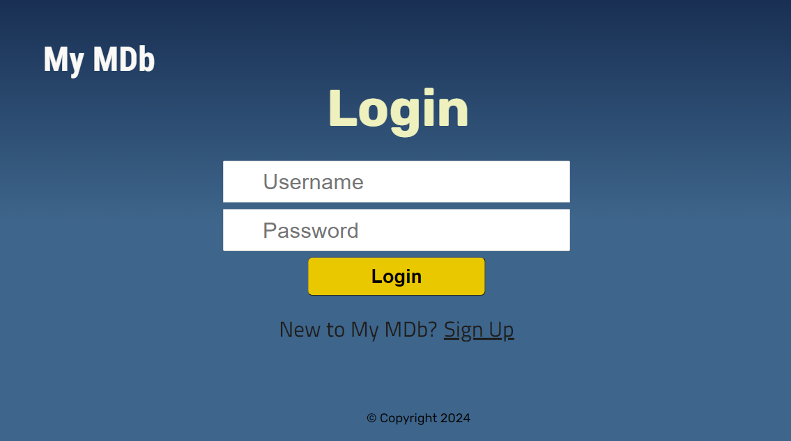

    \
    &nbsp;

- Front-end (Flask) Validation
  - When the user logins, there are validations to ensure the user enters the necessary data in the correct format. 
  - For Username, an entry of 4-15 characters is required.
  - For Password, an entry of 8-20 characters is required.
  - If these validations are not met, a respective flask pop up appears. An example of this is shown below.
  \
    &nbsp;

    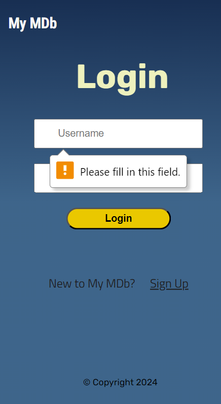

    \
    &nbsp;

- Backend (Python) Validation
  - The same validations mentioned above are also checked in the backend before the user can successfully login. This is to ensure that even if the user were to maliciously change the HTML of the website, they will still not be able to login without the correct credentials.
  - For example, for the Password field, if I were to remove the 'required' attribute within the HTML, this error message is displayed to the user:
  \
    &nbsp;

    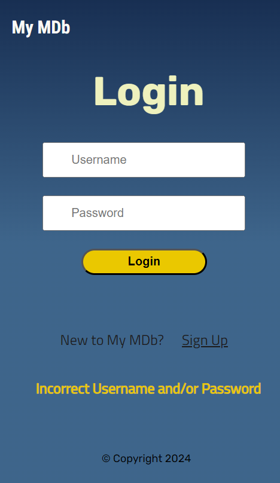

    \
    &nbsp;

- Easy Navigation to Register
  - Within the login page, there is a link for new users to register. When the user hovers over the link, the link becomes less opaque to indicate to the user it is interactive.
  \
    &nbsp;

    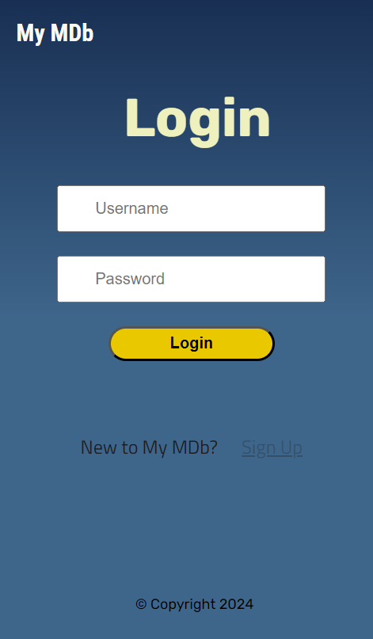

    \
    &nbsp;

### Register Page

- Register Authentication Form
  - Akin to the Login page, the Register page also has (i) the hover feature when returning to the Login page, (ii) placeholders in the form fields, (iii) front-end validation and (iv) backend validation.
  \
    &nbsp;

    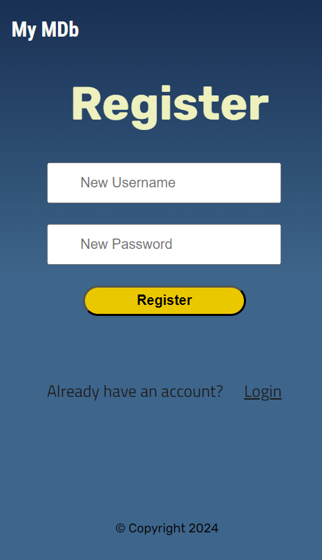

    \
    &nbsp;

- Backend Validation
  - Before creating a new user, the Register Form checks if the username already exists, and the username and password are within the correct range of characters. Below, is an example of this when a user tries to create an account with a username that already exists in the My MDb database.
  \
    &nbsp;

    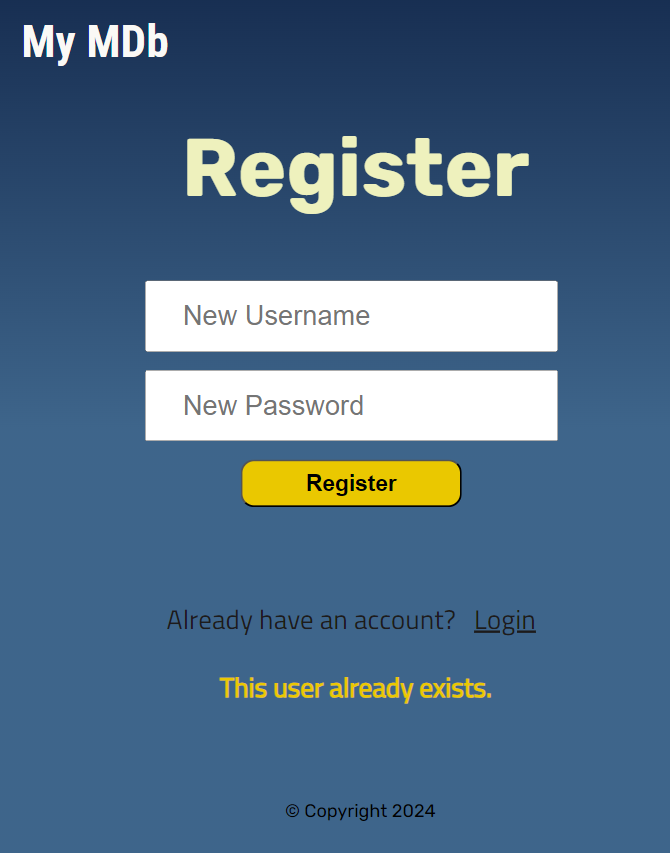

    \
    &nbsp;
  - When these backend validations have been checked through, only then can a new user be registered. Another feature, which is not shown on the interface is that the password gets hashed in the backend.

### My Movies Page

- Dynamic Customisation
  - When the user is logged in/ registered, they are redirected to their account. This page displays their username.
  \
    &nbsp;

    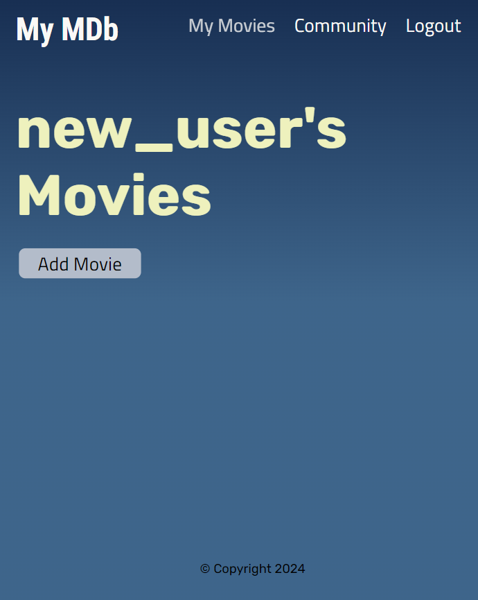

    \
    &nbsp;

- Intuitive Navigation
  - Positioned at the top, the user can either click on the logo or 'My Movies' in the header to redirect themselves back to the their account. As you can see below, when a page is active, it is more translucent to indicate to the user which page they are currently on.
  \
    &nbsp;

    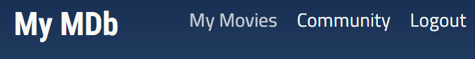

    \
    &nbsp;

  - When the user hovers over another navigation link, it changes colour to depict to the user that it is interactive.
  \
    &nbsp;

    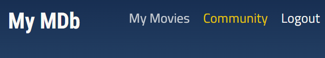

    \
    &nbsp;

- Intuitive Navigation
  - Positioned at the top, the user can either click on the logo or 'My Movies' in the header to redirect themselves back to the their account. As you can see below, when a page is active, it is more translucent to indicate to the user which page they are currently on.
  \
    &nbsp;

    

    \
    &nbsp;

- Logout Authentication Feature
  - At the very right of the header, there is an option for the user to logout of their account. When clicked, the user is logged out and a confirmation message is displayed to the user.
  \
    &nbsp;

    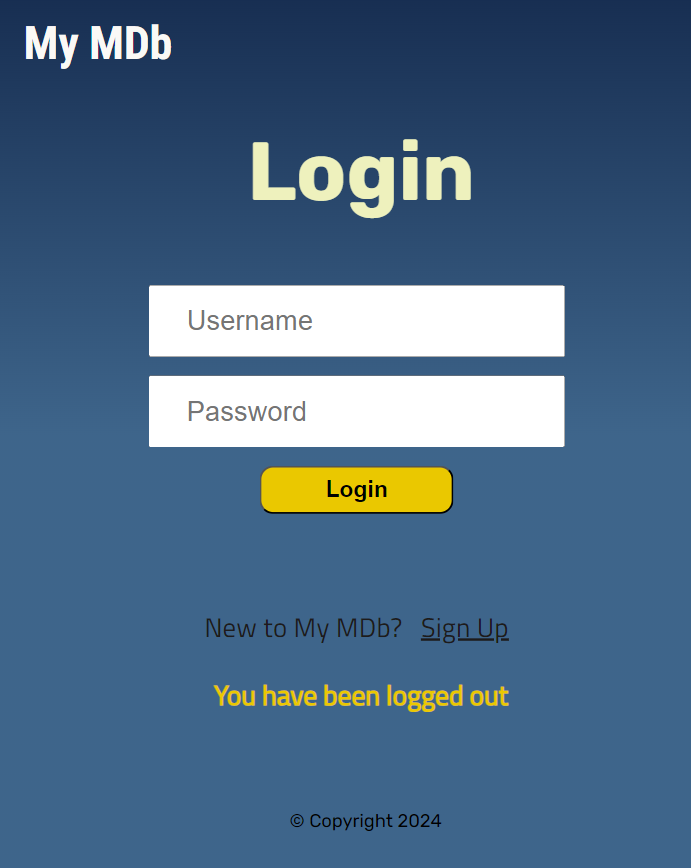

    \
    &nbsp;

- Call to Action
  - The only button present on this page, is an 'Add Movie' button, which will navigate the user to an Add Movie form which will be discussed next.

### Add Movie Card

- Form
  - To create a movie entry, the user must fill out this intuitive form, with the following 3 fields: movie name, movie review and date they watched it.
  \
    &nbsp;

    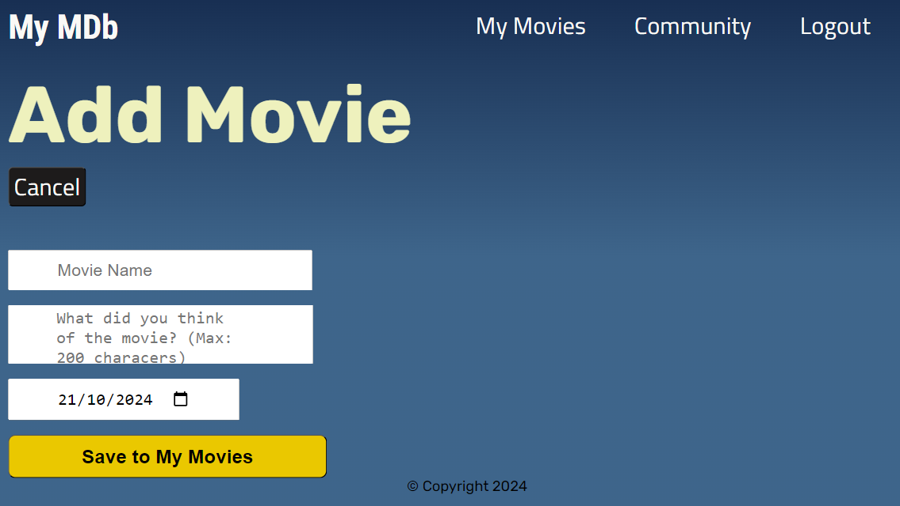

    \
    &nbsp;

- Cancel & Warning Dialog
  - There is an option for the user to dismiss their progress of creating a movie entry and return back to their account. If the user clicks on this cancel button, a warning dialog pops up to ask again if the user wants to 'cancel' as they would not be able to undo this.
  - The 'No, Resume' button is intentionally on the right in case the user accidentally clicks too quickly and will mitigate user error.
  \
    &nbsp;

    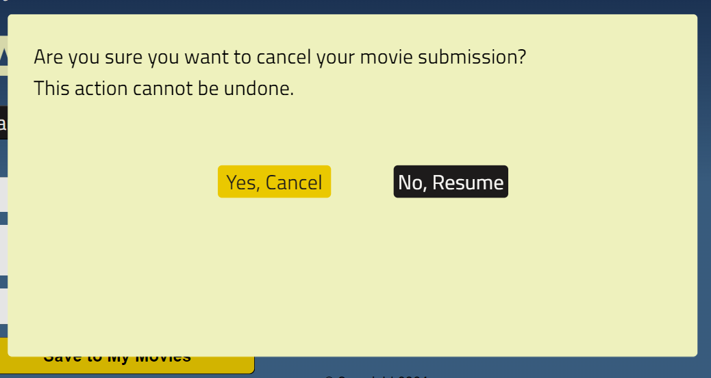

    \
    &nbsp;

- Front-end (Flask) Validation
  - Within this Add Movie form, there are validations to ensure the user enters the necessary data in the correct format. 
  - For Movie Name, an entry of 1-50 characters is required.
  - For Movie Review, an entry of 1-200 characters is required.
  - For View Date, a date picked from the calendar, or written in the correct format DD/MM/YYYY. Date must not be in the future or beyond a 100 years ago. As a proactive user-error mitigation method, the calendar only allows the user to pick valid dates (i.e., blocks out future dates and dates 100 years ago.)
    \
    &nbsp;

    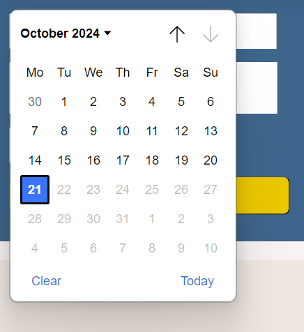

    \
    &nbsp;

  - If these validations are not met, a respective flask pop up appears. An example of this is shown below.
  \
    &nbsp;

    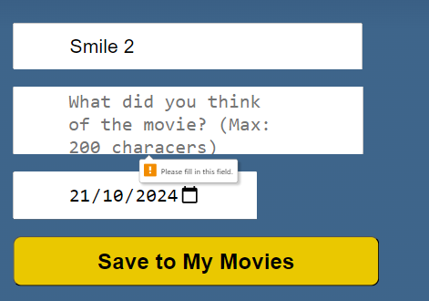

    \
    &nbsp;

- Backend (Python) Validation
  - The same validations mentioned above are also checked in the backend before the user can successfully login. This is to ensure that even if the user were to maliciously change the HTML of the website, they will still not be able to login without the correct credentials.
  - For example, for the Movie Review, if I were to remove the min and max attributes from the HTML, this error message would be displayed to the user:
  \
    &nbsp;

    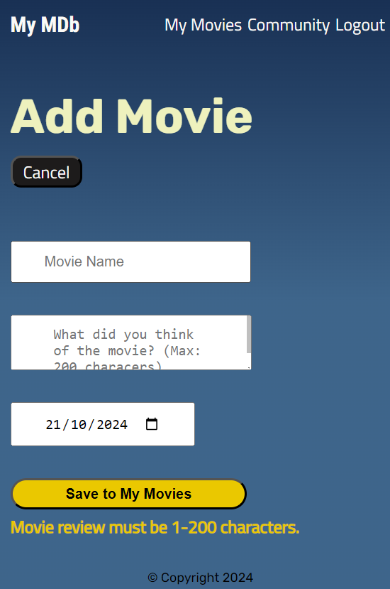

    \
    &nbsp;

### View Movie Cards (in My Movies)

- View Movie Entry
  - Once a movie entry has been successfully submitted, the user will be redirected to their Movies page where the new entry will be displayed. The movies shown on the 'My Movies' page only displays the movies watched by the current user, and are ordered by their view date.
  \
    &nbsp;

    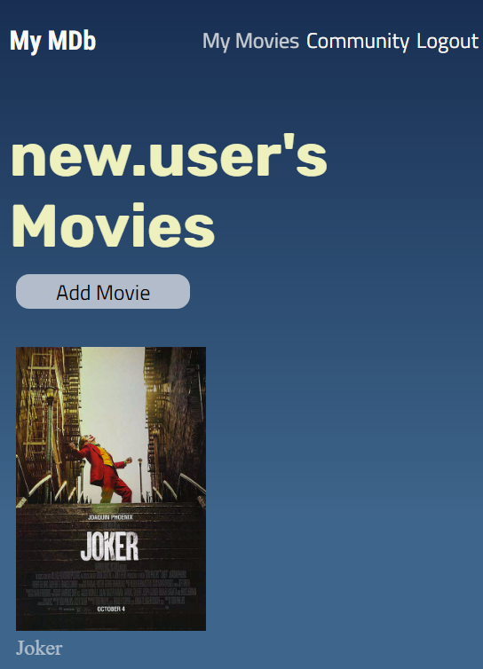

    \
    &nbsp;

- Read More Info
  - When the user clicks on the poster (which goes translucent when hovered to indicate to the user it is interactive), a dialog pops displaying the correct, respective info the user has entered in (the movie name, movie review and view date).
  - It is in this dialog, that the user is able to 'Edit' or 'Delete' their movie entry.
  \
    &nbsp;

    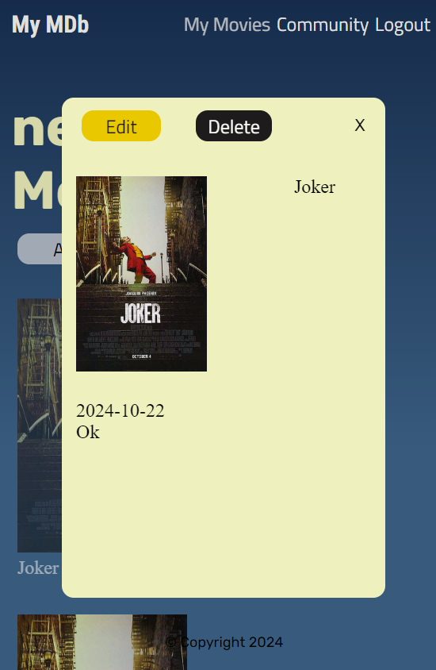

    \
    &nbsp;  

### Edit Movie Card

- Edit Form
  - After the user has clicked on the 'Edit' button displayed in the movie card's dialog, the user will be redirected to a Edit Movie page form.
  - The form is prepopulated with the movie's info, and the user is able to edit the movie review and view date of the movie entry. If the user wishes to update the movie name, they would have to create a new movie entry.
  \
    &nbsp;

    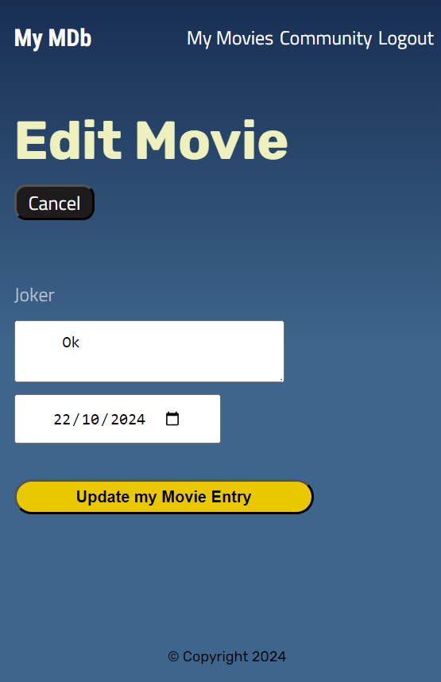

    \
    &nbsp;  

- View Update/s
  - For example, if the user were to change their movie reviewand successfully submit their edit request (refer to screenshot below) 

  \
    &nbsp;

    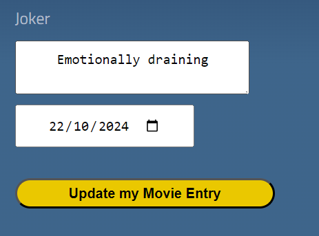

    \
    &nbsp;  
  - This change would be made and can be viewed in the My Movies, which is where the user is redirected to, after the edit submission. Below, is the screenshot evincing that the change that has been made in the backend.

  \
    &nbsp;

    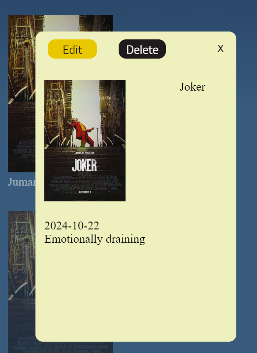

    \
    &nbsp;  

- Validation
  - Similar to the Add Movie Form, there is frontend validation (Flask form pop ups) and also backend validation to ensure that the user enters data in the correct format.
  - The form is prepopulated with the movie's info, and the user is able to edit the movie review and view date of the movie entry. If the user wishes to update the movie name, they would have to create a new movie entry.
  - For example, if a user were to remove the html attribute of the movie review textfield area 'maxlength', and try to submit a movie review with more than 200 characters (ex, 201 characters), an error message would pop up and the user would be redirected to the edit form (refer to screenshot below):
  \
    &nbsp;

    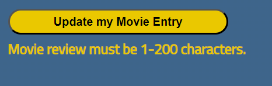

    \
    &nbsp;  

- Cancel Edit Request
  - Just like the Add Movie form, the Edit form has an option for the user to opt out of the edit form. When the user clicks on the 'Cancel button', a warning dialog appears to confirm that the user wants to leave the page. The 'Resume' button is intentionally on the right hand side to help mitigate user error.
  \
    &nbsp;

    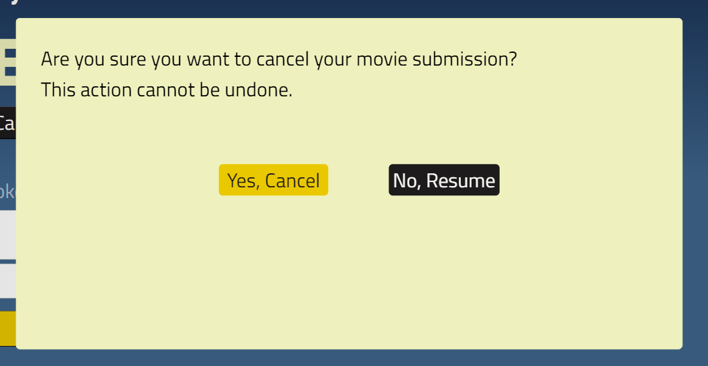

    \
    &nbsp;  
  - If the user were to cancel the edit request, no updates would be committed to the database, and the user would be redirected back to their movies page.

### Delete Movie Card

- Delete Movie 
  - As outlined previously, when a movie card (poster) is clicked on, a dialog with the movie card's info is shown. Within this dialog, there is also an 'Edit' and 'Delete' button.
  - When the 'Delete' button is clicked, a warning dialog appears to the user to confirm that they want to proceed or if they would like to cancel their Delete request.
  \
    &nbsp;

    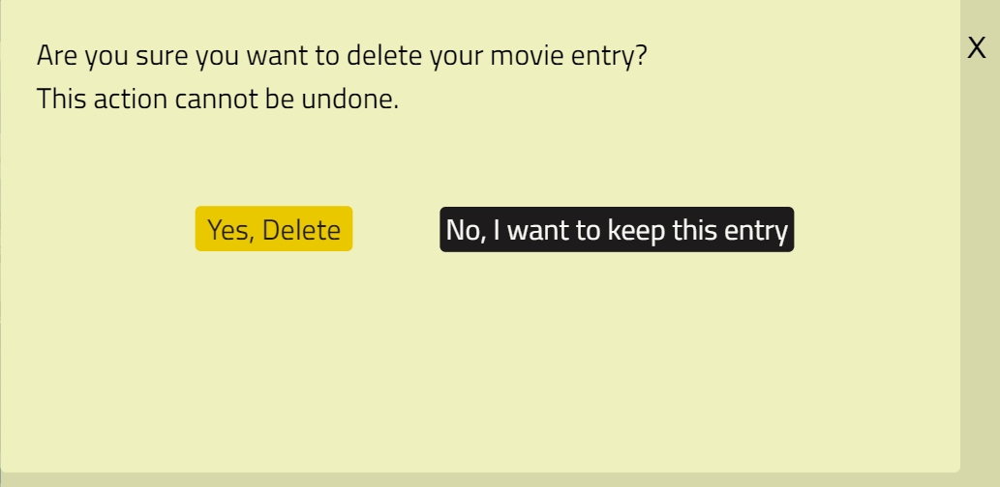

    \
    &nbsp;  
  - If the user clicks on 'Yes, Delete', positioned intentionally on the left-hand side to help mitigate user error, then the movie card is deleted. The user is redirected to their Movies page, and that movie card is removed from their page.

### Community Page

- View other users' movie cards
  - In the navigation header, the user can navigate to the Community page. This page contains all the movie cards watched by users, and is ordered descending by date (i.e., the latest seen movies are on top).
  \
    &nbsp;

    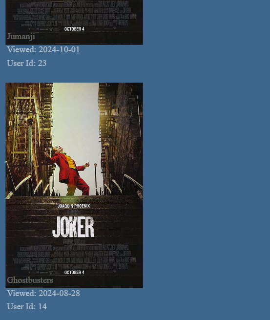

    \
    &nbsp;  
  - The Community movie cards are slightly different to those in My Movies, as they have more info on the main screen (Movie Title, View Date and User ID). They also are not interactable (i.e., you cannot click on the movie poster for a dialog to edit/delete the movie card). Users can only edit/delete movie cards in their own movies page.

\
&nbsp;
[Back to Top](#table-of-contents)
\
&nbsp;

## Future Features (to be implemented)

- Within the Login page, there should be a 'Forgot Password?' option for users, for them to reset their password if needed.

- Integrate [OMDb API](https://www.omdbapi.com/ "OMDb API") so user can search for movies and import their respective movie's information including movie poster, genre, IMDb rating, plot etc. This would also act as a validation if the user has typed in an actual movie.

- Dynamic star ratings entered by the user. To be displayed within the movie cards, specifically under the movie posters, where it will display 0-5 stars based on the user's personal movie rating.

- More filters within the My Movies and Community pages to allow the user to search for specific movies, view dates, potential star ratings (for example, 0-1 stars, 1-2 stars etc).

- Include a contact form/ methods so that users are able to reach out for support if the website is down or if they have any issues or questions.

\
&nbsp;
[Back to Top](#table-of-contents)
\
&nbsp;

# Technologies used

## Languages

- [HTML](https://en.wikipedia.org/wiki/HTML "HTML")
  
- [CSS](https://en.wikipedia.org/wiki/CSS "CSS")

- [JavaScript](https://en.wikipedia.org/wiki/JavaScript "JavaScript")

- [Python](https://en.wikipedia.org/wiki/Python_(programming_language) "Python")

## IDE

- [Codeanywhere](https://codeanywhere.com/ "Codeanywhere")

- [GitPod](https://www.gitpod.io/ "GitPod")

## Libraries & Framework

- [Google Fonts](https://fonts.google.com/ "Google Fonts")
  
- [Font Awesome library](https://fontawesome.com/ "Font Awesome")

- [Favicon](https://favicon.io/ "Favicon")

- [Flask](https://flask.palletsprojects.com/en/2.3.x/templating/ "Flask")

- [PostgreSQL](https://www.postgresql.org/ "PostgreSQL")

## Tools

- [Mila Note](https://milanote.com/ "Mila Note")
  
- [Balsamiq](https://balsamiq.com/wireframes/ "Balsamiq")

- [CI Full Template](https://github.com/Code-Institute-Org/ci-full-template "CI Full Template")
  
- [Coolers](https://coolors.co/ "coolers")
  
- [Am I Responsive](https://ui.dev/amiresponsive "Am I Responsive")

- [W3C HTML Validation Service](https://validator.w3.org/ "W3C HTML")
  
- [W3C CSS Validation Service](https://jigsaw.w3.org/css-validator/ "W3C CSS")

- [W3C JS Validation Service](https://jshint.com "JSHint JS") 

- [Python PEP8 checker](https://www.codewof.co.nz/style/python3/ "Python PEP8 checker")

\
&nbsp;
[Back to Top](#table-of-contents)
\
&nbsp;

# Validating

## HTML Validator Results

- Using the w3 validator, I inputted the Heroku deployment URL to check the HTML throughout the website. There were no errors.
  - HTML validator [results](docs/validator/w3-nu-html-validation.png "W3C HTML")

## CSS Validator Results

- Initially for the CSS, there were 9 value errors, so these have been amended and as a result, there are now no errors.
  - CSS (style.css) validator [results](docs/validator/w3-css-validation.png "W3C CSS")

## JS Validator Results

- There are five warnings within the index.js, all to do with the ESVersion and not the syntax.
  - JS (index.js) validator [results](docs/validator/js-hint-js-validation.png "JSHint JS")

## Python PEP8 Checker Results

- __ init __.py
  - Initially 7 style issues were located, mainly around 'whitespace's. The important ones were resolved.
  - Python PEP8 checker [results](docs/validator/python-check-init.png "Python PEP8")

- routes.py
  - Most of the errors around the syntax (mostly to do with spacing, indentation and required docstrings) were resolved. Only ones left are to do with imports and long lines.

- run.py
  - Initially 3 style issues were located, to do with leaving a blank line at the end of the file etc. These have been resolved and there are no style errors now.
  - Python PEP8 checker [results](docs/validator/python-check-run.png "Python PEP8")

- models.py
  - Initially style issues were identified, mostly to do with 'whitespaces', spacing before and after classes and docstrings. The issues not relating to import or breaking up long lines, were resolved.
  - Python PEP8 checker [results](docs/validator/python-check-models.png "Python PEP8")

- validation.py
  - The main style issues resolved for this file, were to do with re-formatting the docstrings, to ensure that there is command, description, args and parameters.
  - Python PEP8 checker [results](docs/validator/python-check-validation.png "Python PEP8")

\
&nbsp;
[Back to Top](#table-of-contents)
\
&nbsp;

# Testing

## Testing User Stories

The initial phase of testing consisted of checking through the stories. Below, I have listed the user stories along with their respective screenshots and descriptions, explaining how they each have been met.
\
&nbsp;

1. As a user, I want to be able to login/ register my account.
      \
    &nbsp;
    

    
  \
  &nbsp;
    Before the user can access their account, they must login. If the user does not have an account, there is also an option for them to create an account. Both Login and Register pages allow users to easily navigate between the two.
    \
    &nbsp;

2. As a user, I want to be able to create, read, update and delete my movie entries.
      \
    &nbsp;
    

    

    

    
  \
  &nbsp;
    The user's account 'My Movies' is where the user can view their movies and also fill a (flask) form to add a movie to their database. When they click on their respective movie entry, a dialog appears showing the respective movie's info and also providing the option to the user to edit or delete the movie entry.
    \
    &nbsp;
    
3. As a user, I want to be able to view other users' entries.
    &nbsp;
    
  \
  &nbsp;
    Aside from My Movies page, there is another page called Community, where the user can see what movies other users have been watching.
    \
    &nbsp;

4. As a user, I want to be able to navigate around the website easily.
    &nbsp;
    
  \
  &nbsp;
    The website has a clear and clean navigation layout to make it intuitive for the user to navigate around the website. One of the features is a header, which indicates which page is active. Another feature is when users hover over interactable UI components, there are visual effects (for example change of colour, opacity etc.)
    \
    &nbsp;

5. As a user, I want to be able to logout of my account.
    &nbsp;
    

    
  \
  &nbsp;
    On the top right-hand corner, one of the options in the navigation header is to 'Logout'. When clicked, the user is logged out and directed back to the login page.
    \
    &nbsp;

\
&nbsp;
[Back to Top](#table-of-contents)
\
&nbsp;

## Debugging

These are the key issues that emerged throughout the project development, and how I resolved them:

- routes.py
  - For register(), when implementing the existing user validation, there was an Unbound Local Error due to a User query calling a variable that was only declared afterwards. This was resolved by reordering the local variables.
  - For register(), when a new user registered and flask rendered directly to the My Movies page, even though the newly registered username was rendered fine, there was an issue with loading the correct movies. This was resolved by switching the redirect url from the My Movies page to the Login page instead. A flash message is displayed to the user confirming that their credentials has been set up and they can login again.
  - For my_movies(), initially all the movies were showing up in the user's My Movies page, which was not the intended experience, as it should have only been displaying the user's movies. To resolve this, a multiple query was used (i) to order the movies by their 'view date' and (ii) to filter movies by the user in session's ID. 
  - For edit_movie(), when an error validation was being caught, there was a werkzeug error when redirecting the url. This was resolved by passing and including the respective movie id within the url.
  - The app route names have all been modified to be user-friendly for ther users to type in the url (i.e., only lowercase and dashes used).
  - When using the Edit Movie form, the user's current 'movie review' and 'view date' were not being displayed in the Flask form fields for the user to edit. This was resolved by getting and setting the data to the fields in edit_movie(), right after the form variable was declared.

- validation.py
  - When running check_date_entry(), the website would crash and display ```"TypeError: '>=' not supported between instances of 'str' and 'datetime.datetime"```. This was resolved by using Python's strptime() method which formats the string to a datetime object.

- run.py
  - There was initially an operational error when running ```from my_mdb import db``` in a terminal. This was due to a misspelling of the app's name (i.e.,'mymdb' was written and not 'my_mdb') which imported the app so this was amended. 

- index.js
  - The movie card dialogs were successfully being passed flask route data, however the edit button for each dialog was only passing the first movie card's ID (relative to the user's account). This was resolved by assigning the dialog reference later in the getMovieDataforDialog() function and passing the movie id in that method from the dialog class (in movie-dialog.html).
  - The close button for dialog was also working (i.e., closing the movie dialog) for the first movie card. To resolve this, in movie-dialog.html, an id which passes through the movie id, a data movie Id attribute and a class was added to the close 'x' button. The class of this button, was then targetted in the index.js query selectors and an addEventListener method for all the buttons with this class was added. Console logs were used to debug and figure out what was happening/ what data was being passed.

- .gitignore
  - Initially, the env.py was not included in this file, and was getting committed to the respository. To rectify this, ```git rm -r --cached .env``` was ran in a terminal and env.py was added to the .gitignore file. Additionally, a new secret key was created from running the command ```openssl rand -hex 32```.

- miscellaneous
  - There was an issue near the beginning of the project when the style.css was not getting read. This was resolved by creating a 'static' folder (which contains the css, favicons, img and js file), within my project folder.

\
&nbsp;
[Back to Top](#table-of-contents)
\
&nbsp;

## Unfixed Bugs

- Flask field validation pop-ups should be adjusted according to media queries.

- Some pages have white spaces (when scrolled horizontally, vertically or both).

- CSS Media queries for larger devices (i.e., laptops + desktops) are not complete. The My Movies and Community Page should display movie cards as rows of 4, and not a column like it is set by default for smaller devices (i.e., mobiles + tablets). 
 - This issue may also be the cause of why sometimes the page gets 'cut off' at the bottom.

- For some media queries/ pages, the footer 'floats'. It should be rooted at the bottom of the page.

\
&nbsp;
[Back to Top](#table-of-contents)
\
&nbsp;

# Deployment

## Heroku 

This project was deployed via Heroku, using the following steps:

1. Log in Heroku website, create a new app
2. Go to Settings and add the following Config Vars:
  - DATABASE_URL: Enter Postgres URL postgres://XXX
  - IP: 0.0.0.0
  - PORT: 5000
  - SECRET_KEY: XXXX
3. In the 'Deployment method' section, connect to GitHub (and also Enable Automatic Deploys).
4. Run in console: (```python3```)
5. In console, import Postgres database: (```from my_mdb import db```) and then (```db.create_all()```).
6. Deploy the website. This link is [My Mdb Website](https://my-mdb-eadb6d03939b.herokuapp.com/ "My Mdb").
7. If any changes were required, they could be done, commited and pushed to GitHub and the changes would automatically be updated and deployed.

## How to Run this Project Locally 

To work on this project within your local IDE such as VSCode, Pycharm etc:
  1. Follow this link to the [Project GitHub repository](https://github.com/rachelcluke/my-MDb "Project GitHub respository")
  2. Under 'Code', copy the Clone URL for the repository.
  3. In your local IDE, open a terminal.
  4. Navigate into the desired working directory.
  5. Type ```git clone``` and then paste the URL you copied in Step 2.
  6. Hit Enter and your local clone will be created.
  7. Within your project, in a terminal run ```pip install -r /path/to/requirements.txt```.
  8. Create an env.py file within the project folder and include the name of this file in your .gitignore file before committing.
  9. Within your env.py file, add and modify the following:
    - ```import os```
    - ```os.environ.setdefault("IP", "0.0.0.0")```
    - ```os.environ.setdefault("PORT", "XXXX")```
    - ```os.environ.setdefault("SECRET_KEY", "XXXX")```
    - ```os.environ.setdefault("DEBUG", "True")```
    - ```os.environ.setdefault("DB_URL", "postgresql:///XXX")```

For further reference on cloning a respository from GitHub, click [here.](https://docs.github.com/en/repositories/creating-and-managing-repositories/cloning-a-repository "Cloning a repository")

&nbsp;
[Back to Top](#table-of-contents)
\
&nbsp;

# Credits

For mentoring, code advising and project reviewing:

- [Simen Daehlin](https://github.com/Eventyret "Simen Daehlin")

For technical support and guidance:

- [Tutors at Code Institute](https://codeinstitute.net/blog/meet-our-support-teams/ "Code Institute Support")

For content and design inspiration:

- [IMDb](https://www.imdb.com/ "IMDb")

- [Uizard](https://uizard.io/templates/tablet-templates/movie-streaming-tablet-app/ "Uizard")

- [Colorlib](https://colorlib.com/wp/html5-and-css3-login-forms/ "Colorlib")

\
&nbsp;

Finally, a big shoutout to my family, friends and loved ones for their unwavering encouragement and support.

\
&nbsp;

---

\
&nbsp;

Thank you, from Rachel Luke.

\
&nbsp;
[Back to Top](#table-of-contents)