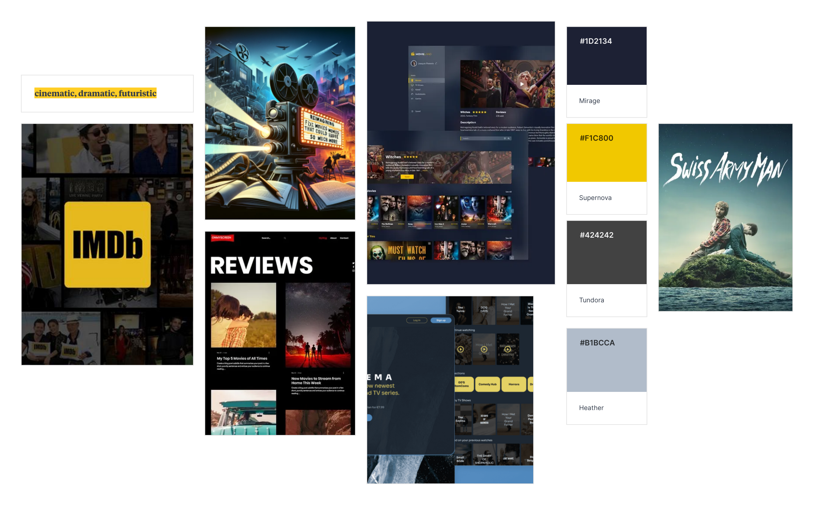
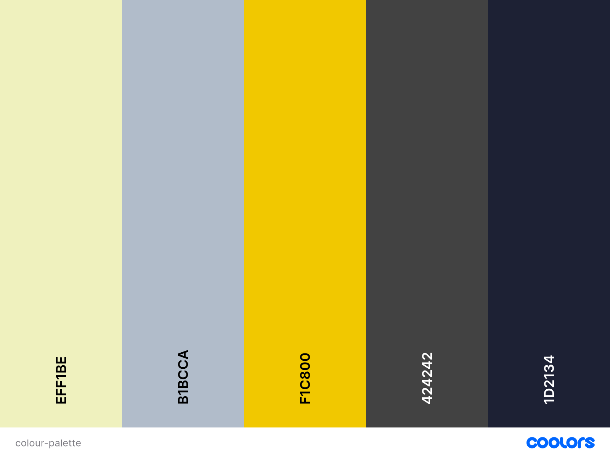

#myMDB (Movie Tracker) Website

<!--[Am I responsive - myMDB](docs/XXX "Am I responsive")-->

# Project Overview

Welcome,

This is myMDb ("my MDb") website, a full-stack site for movie enthusiasts to search, track and review movies they have watched. They will also be able to view what movies other members have been watching. This is Rachel Luke's submission for Code Institute's Backend Development Milestone.

The following are high-level details of this project:

-  This is a relational database backed Flask project for a web application that allows users to store and manipulate data records on movies they have watched.
- The main technologies used are HTML, CSS, JavaScript, Python+Flask and PostgreSQL.
- The project demonstrates backend development web design.
- User functionality is intuitive to users (to create, locate, display, edit and delete records).
- The site has a main navigation in the header and a structured layout.
- Git & GitHub are used for version control.
- Any external code sources used in the project are clearly identified in the code itself and in this README.md file
- The final version has been deployed via GitHub Pages.
- There are no passwords or secret keys in the project repository. 


The last update to this file was: **October 20th, 2024**

# Table of Contents

- [My MDb](#my-mdb)
- [Project Overview](#project-overview)
- [Table of Contents](#table-of-contents)
- [UX](#ux)
  - [User Goals](#user-goals)
  - [User Stories](#user-stories)
  - [Site Owners Goals](#site-owners-goals)
    - [Requirements](#requirements)
    - [Expectations](#expectations)
- [UI / Design Choices](#ui-design-choices)
  - [Moodboard](#moodboard)
  - [Fonts](#fonts)
  - [Icons](#icons)
  - [Colours](#colours)
  - [Media Queries](#media-queries)
  - [Wireframes](#wireframes)
  - [Mockups](#mockups)
- [Features](#features)
  - [Existing Features](#existing-features)
   - [Future Features - to be implemented](#future-features)
- [Technologies used](#technologies-used)
  - [Languages](#languages)
  - [IDE](#ide)
  - [Libraries & Framework](#libraries-framework)
  - [Tools](#tools)
- [Validating](#validating)
- [Testing](#testing)
- [Deployment](#deployment)
 -[Heroku](#heroku)
 -[How to run this project localy](#run-locally)
- [Credits](#credits)


# UX

## User Goals

1. Upload and track movies watched.
2. Edit and delete movie listings/ reviews.
3. Easily navigate around website.
4. Log in/sign up account.
5. View other users' listed movies.

## User Stories

1. As a user, I want to be able to login/ register my account.
2. As a user, I want to be able to create, read, update and delete my movie entries.
3. As a user, I want to be able to view other users' entries.
4. As a user, I want to be able to navigate around the website easily.
5. As a user, I want to be able to logout of my account.

## Site Owners Goals

1. Upload their own watched movies and view other users' tracked movies.
2. Increase the number of online foot traffic.
3. Increase rankings on search engines.

### Requirements

1. Easy to navigate on various screen sizes.
2. Clear information on what the website offers (a movie tracker).
3. Functioning CRUD website to track own movies and view other users' watched movies.
4. Working backend and database management.
5. Visually inviting so users engage longer on the website.
  
### Expectations

1. I expect to be able to login or sign up for an account if I do not have an existing one.
2. I expect to be able to CRUD (create, read, update and delete) my movie trackings.
3. I expect to be able to view other users' movie trackings.
4. I expect screen size not to affect the quality of the website.
5. I expect all information to be correct and accurate.

\
&nbsp;
[Back to Top](#table-of-contents)
\
&nbsp;

# UI / Design Choices

## Moodboard

One of the first milestones of this project was to create a moodboard to help envision the overall house style of the webiite and ensure that all of the sections and elements are cohesive. The software I used to create the moodboard for this website is [Mila Note](https://milanote.com/ "Mila Note").
Below, is the moodboard:


## Fonts

## Icons

## Colours

The colour scheme of the website is inspired by the moodboard (previously depicted). I have used [Coolers](https://coolors.co/ "coolers") to retrieve the desired colour codes and generate the colour palette.

Below, is the color palette:


## Media Queries

As a starting point, I have designed this website with a mobile first mindset using the iPhone 5/SE (320px) as the smallest screen size for styling to look good on. Then I created 3 additional media queries for largers devices listed below.

| Screen Size |  Breakpoint |
| ----------- | ----------- | 
| mobile      |  <320px     |
| tablet      |  => 768px   |
| laptop      |  => 1920px  |
| desktop     |  => 2560px  |

\
&nbsp;
[Back to Top](#table-of-contents)
\
&nbsp;


## Wireframes

I have used [Balsamiq](https://balsamiq.com/wireframes/ "Balsamiq") to develop my wireframes for my website. I initially created the mobile version and then the wireframes and then scaled it up for desktop. The website has 3 pages that are all scrollable and displays/hides sections with logic in lieu of having even more HTML pages to decrease inconvenient reloading of entire website.

The wireframes are below:

[Landing Page - Mobile & Desktop Wireframes](docs/wireframes/wireframe-landing-page-mobile-desktop.png "home mobile and desktop wireframes")

[Login Page - Mobile & Desktop Wireframes](docs/wireframes/wireframe-login-page-mobile-desktop.png "login mobile and desktop wireframes")

[Main Page - Mobile & Desktop Wireframes](docs/wireframes/wireframe-landing-page-mobile-desktop.png "main mobile and desktop wireframes")

[Community Page - Mobile & Desktop Wireframes](docs/wireframes/wireframe-community-page-mobile-desktop.png "community mobile and desktop wireframes")

\
&nbsp;
[Back to Top](#table-of-contents)
\
&nbsp;

## Mockups
Based on the wireframes, I created mockups using [Figma](https://www.figma.com/ "Figma") to help me plan the interface design. Mockups for both mobile and desktop have been created as part of the website design phase, and can be viewed via this link [Mockups](https://www.figma.com/design/9iYeCSMx1ZhPTEsWesTW6V/Project-3?node-id=0-1&t=h3CqbXc5uzz9nmsm-1 "Mockups").


\
&nbsp;
[Back to Top](#table-of-contents)
\
&nbsp;

# Features 

## Existing Features

## Future Features (to be implemented)

- Integrate [OMDb API](https://www.omdbapi.com/ "OMDb API") so user can search for movies and import their respective movie's information including movie poster, genre, IMDb rating, plot etc. This would also act as a validation if the user has typed in an actual movie.

- Dynamic star ratings entered by the user. To be displayed within the movie cards, specifically under the movie posters, where it will display 0-5 stars based on the user's personal movie rating.

- More filters within the My Movies and Community pages to allow the user to search for specific movies, view dates, potential star ratings (for example, 0-1 stars, 1-2 stars etc).


\
&nbsp;
[Back to Top](#table-of-contents)
\
&nbsp;

# Technologies used

## Languages

- [HTML](https://en.wikipedia.org/wiki/HTML "HTML")
  
- [CSS](https://en.wikipedia.org/wiki/CSS "CSS")

- [JavaScript](https://en.wikipedia.org/wiki/JavaScript "JavaScript")

- [Python](https://en.wikipedia.org/wiki/Python_(programming_language) "Python")

## IDE

- [Codeanywhere](https://codeanywhere.com/ "Codeanywhere")

- [GitPod](https://www.gitpod.io/ "GitPod")

## Libraries & Framework

- [Google Fonts](https://fonts.google.com/ "Google Fonts")
  
- [Font Awesome library](https://fontawesome.com/ "Font Awesome")

- [Favicon](https://favicon.io/ "Favicon")

- [Flask](https://flask.palletsprojects.com/en/2.3.x/templating/ "Flask")

- [PostgreSQL](https://www.postgresql.org/ "PostgreSQL")

## Tools

- [Mila Note](https://milanote.com/ "Mila Note")
  
- [Balsamiq](https://balsamiq.com/wireframes/ "Balsamiq")

- [CI Full Template](https://github.com/Code-Institute-Org/ci-full-template "CI Full Template")
  
- [Coolers](https://coolors.co/ "coolers")
  
- [Am I Responsive](https://ui.dev/amiresponsive "Am I Responsive")

- [W3C HTML Validation Service](https://validator.w3.org/ "W3C HTML")
  
- [W3C CSS Validation Service](https://jigsaw.w3.org/css-validator/ "W3C CSS")

- [W3C JS Validation Service](https://jshint.com "JSHint JS") 

- [Python PEP8 checker](http://ww7.pep8online.com/?usid=27&utid=8834820127 "Python PEP8 checker")

\
&nbsp;
[Back to Top](#table-of-contents)
\
&nbsp;

# Validating

## HTML Validation

## CSS Validation

## JS Validation

## Python PEP8 checker

\
&nbsp;
[Back to Top](#table-of-contents)
\
&nbsp;

# Testing

## Testing User Stories

The initial phase of testing consisted of checking through the stories. Below, I have listed the user stories along with their respective screenshots and descriptions, explaining how they each have been met.
\
&nbsp;

1. As a user, I want to be able to login/ register my account.
      \
    &nbsp;
    

    
  \
  &nbsp;
    Before the user can access their account, they must login. If the user does not have an account, there is also an option for them to create an account. Both Login and Register pages allow users to easily navigate between the two.
    \
    &nbsp;

2. As a user, I want to be able to create, read, update and delete my movie entries.
      \
    &nbsp;
    

    

    

    
  \
  &nbsp;
    The user's account 'My Movies' is where the user can view their movies and also fill a (flask) form to add a movie to their database. When they click on their respective movie entry, a dialog appears showing the respective movie's info and also providing the option to the user to edit or delete the movie entry.
    \
    &nbsp;
    
3. As a user, I want to be able to view other users' entries.
    &nbsp;
    
  \
  &nbsp;
    Aside from My Movies page, there is another page called Community, where the user can see what movies other users have been watching.
    \
    &nbsp;

4. As a user, I want to be able to navigate around the website easily.
    &nbsp;
    
  \
  &nbsp;
    The website has a clear and clean navigation layout to make it intuitive for the user to navigate around the website. One of the features is a header, which indicates which page is active. Another feature is when users hover over interactable UI components, there are visual effects (for example change of colour, opacity etc.)
    \
    &nbsp;

5. As a user, I want to be able to logout of my account.
    &nbsp;
    

    
  \
  &nbsp;
    On the top right-hand corner, one of the options in the navigation header is to 'Logout'. When clicked, the user is logged out and directed back to the login page.
    \
    &nbsp;

\
&nbsp;
[Back to Top](#table-of-contents)
\
&nbsp;

## Debugging

These are the issues that emerged throughout the project development, and how I resolved them:

- auth.html
  - TBD

- style.css
  - TBD

\
&nbsp;

## Unfixed Bugs 

- In the Edit Movie page section, the user's current 'movie review' and 'view date' should be displayed  in the Flask form fields for the user to edit, however they are not. Currently only shows empty 'movie review' textarea field and today's date in 'view date'.

- Some pages have white spaces (when scrolled horizontally, vertically or both).

\
&nbsp;
[Back to Top](#table-of-contents)
\
&nbsp;

# Deployment

## Heroku 

This project was deployed via Heroku, using the following steps:

1. Generated requirements.txt and Procfile (containing command: "web: python run.py")
2. Modified __init__.py file so that SQLAlchemy can also read our external database
3. Saved, added, committed and pushed changes to GitHub.
4. Logged in Heroku website, created a new app and added Config Vars.
5. In the 'Deployment method' section, connected to GitHub (and also Enable Automatic Deploys).
6. Run console and imported Postgres database.
7. The website deployed and the link is [My Mdb Website](https://my-mdb-eadb6d03939b.herokuapp.com/ "My Mdb")
8. If any changes were required, they could be done, commited and pushed to GitHub and the changes would automatically be updated and deployed.

## How to Run this Project Locally 

To work on this project within your local IDE such as VSCode, Pycharm etc:
  1. Follow this link to the [Project GitHub repository](https://github.com/rachelcluke/my-MDb "Project GitHub respository")
  2. Under 'Code', copy the Clone URL for the repository.
  3. In your local IDE, open a terminal.
  4. Navigate into the desired working directory.
  5. Type ```git clone``` and then paste the URL you copied in Step 2.
  6. Hit Enter and your local clone will be created.

For further reference on cloning a respository from GitHub, click [here.](https://docs.github.com/en/repositories/creating-and-managing-repositories/cloning-a-repository "Cloning a repository")


&nbsp;
[Back to Top](#table-of-contents)
\
&nbsp;

# Credits

For mentoring, code advising and project reviewing:

- [Simen Daehlin](https://github.com/Eventyret "Simen Daehlin")

For technical support and guidance:

- [Tutors at Code Institute](https://codeinstitute.net/blog/meet-our-support-teams/ "Code Institute Support")

For content and design inspiration:

- [IMDb](https://www.imdb.com/ "IMDb")

- [Uizard](https://uizard.io/templates/tablet-templates/movie-streaming-tablet-app/ "Uizard")

- [Colorlib](https://colorlib.com/wp/html5-and-css3-login-forms/ "Colorlib")

Finally, a big shoutout to my family, friends and loved ones for their unwavering encouragement and support.

---

Thank you, from Rachel Luke.

\
&nbsp;
[Back to Top](#table-of-contents)